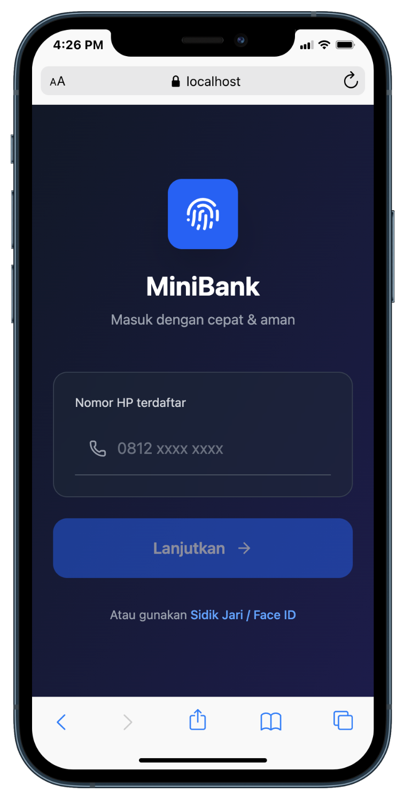
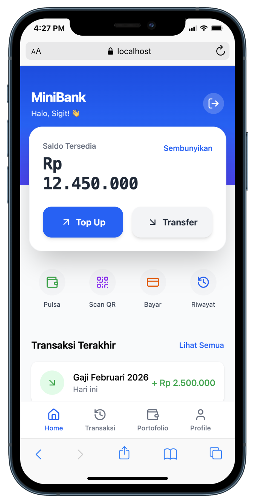

## 💳 Mini Bank App

### 🔐 Halaman Login



### 🏠 Halaman Home



**Mini Bank App** adalah aplikasi simulasi perbankan digital sederhana yang dibangun menggunakan **React.js**. Aplikasi ini dirancang untuk meniru fitur dasar layanan perbankan modern seperti pengelolaan saldo, transfer dana, dan riwayat transaksi dengan antarmuka yang cepat, responsif, dan mudah digunakan.

Project ini dibuat sebagai studi kasus untuk memahami arsitektur aplikasi keuangan digital sekaligus sebagai portfolio pengembangan frontend modern.

---

## 🎯 Tujuan Project

- Mempelajari implementasi aplikasi fintech sederhana
- Menerapkan arsitektur frontend modern berbasis React
- Mensimulasikan transaksi keuangan digital
- Menjadi fondasi untuk pengembangan aplikasi keuangan skala besar

---

## ✨ Fitur Utama

- 🔐 Autentikasi pengguna (Login & Register)
- 💰 Dashboard saldo & ringkasan akun
- 🔁 Transfer antar pengguna
- 📜 Riwayat transaksi
- ➕ Deposit & penarikan saldo
- 🔔 Notifikasi status transaksi
- 📱 Desain responsif untuk mobile & desktop

---

## 🛠️ Tech Stack

- **React.js** – Component-based UI
- **React Router** – Routing & navigasi
- **Context API / Redux (opsional)** – State management
- **Axios / Fetch API** – HTTP client
- **CSS / Tailwind / Bootstrap** – Styling

---

## 📂 Struktur Folder (Contoh)

```
src/
 ├── components/
 ├── pages/
 ├── services/
 ├── context/
 ├── hooks/
 ├── utils/
 └── App.jsx
```

---

## ⚙️ Instalasi & Menjalankan Project

```bash
# clone repository
git clone https://github.com/Sigit-Wasis/Mini-Bank-React

# masuk ke folder project
cd mini-bank-react

# install dependencies
npm install

# jalankan aplikasi
npm run dev
```

---

## 🔐 Praktik Keamanan

- Token-based authentication (JWT)
- Protected routes untuk halaman privat
- Validasi input pengguna
- Manajemen session

---

## 🚀 Roadmap Pengembangan

- [ ] Integrasi backend API
- [ ] Grafik laporan keuangan
- [ ] Multi-account support
- [ ] Notifikasi real-time

---

## 📌 Kegunaan Project

Project ini cocok digunakan sebagai:

- [x] Portfolio frontend developer
- [x] Studi kasus aplikasi fintech
- [x] Latihan integrasi React dengan REST API
- [x] Dasar pengembangan e-wallet atau POS system

---

## 👨‍💻 Author

Dikembangkan sebagai bagian dari pembelajaran dan eksplorasi pengembangan aplikasi keuangan digital.
